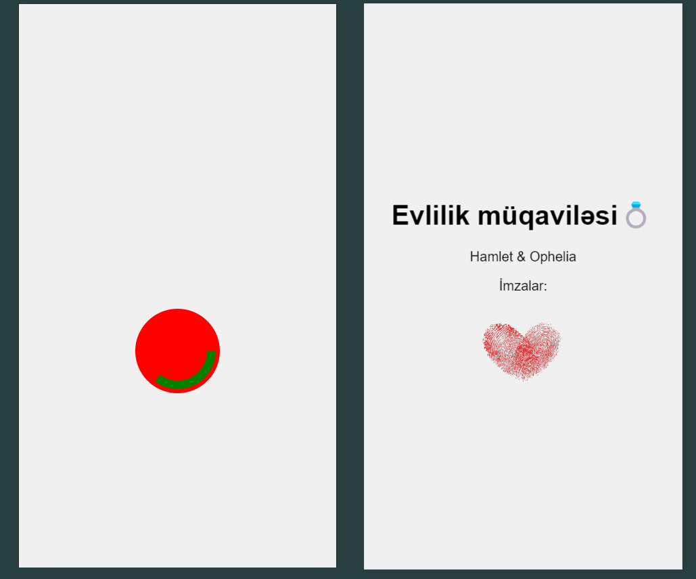

# Marriage Proposal Web App 💍

This is a **Flask-based web app** designed for a unique, customizable marriage proposal experience. Simply add the couple's names to the URL, and watch as the magic unfolds!


## Deployment 🌐
The app is deployed and live on PythonAnywhere. You can access the live version here (only work with phones):
[**Live Demo**](http://secretbutton.pythonanywhere.com/?first=Hamlet&second=Ophelia)


## Features ✨
- **Personalized Proposal**: Customize the page by adding the couple's names to the URL like so:
  -`/?first=BoyName&second=GirlName`
  - Example: `http://secretbutton.pythonanywhere.com/?first=Hamlet&second=Ophelia`

- **Interactive Experience**: 
  - The page displays a button.
  - Hold down the button, and a marriage contract with the couple’s names appears.
  - Background music plays, enhancing the mood.
  - At the end, a heart made of two fingerprints appears, symbolizing the bond between the two.

- **Customizable**: The names and fingerprints change based on the input in the URL, making each proposal unique.

## How to Use 🛠
1. Clone the repository:
```bash
git clone https://github.com/zenithura/marriage-proposal.git
cd marriage-proposal
```
       
2. Install dependencies:
```bash
pip install -r requirements.txt
```

3. Run the app locally:
```bash
python app.py
```

4. Open your browser and visit:
```
http://127.0.0.1:5000/?first=John&second=Jane
```

   

## Screenshots 📸



  
